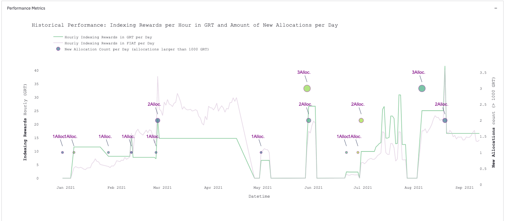
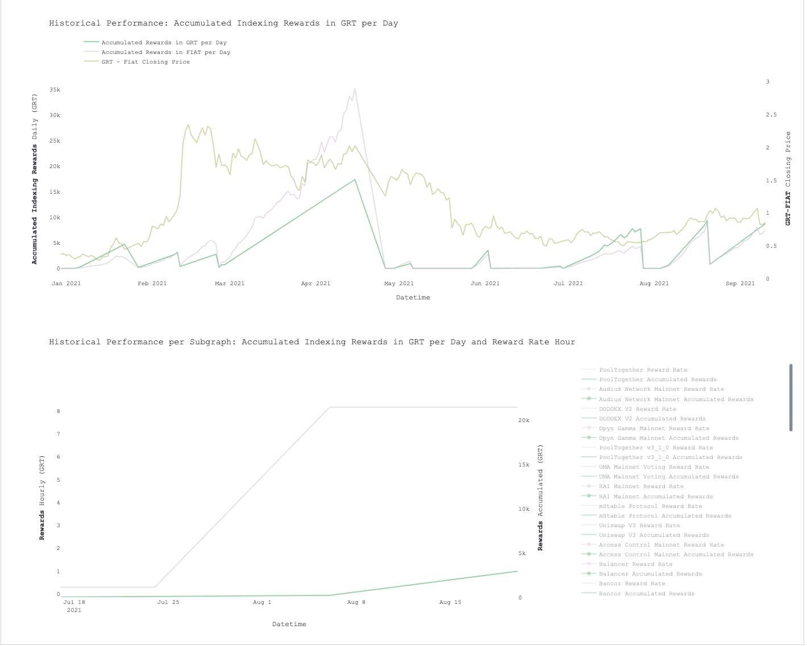
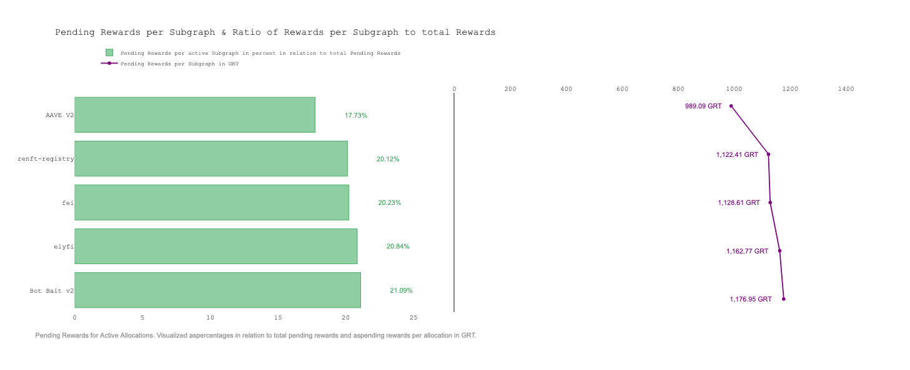

# Changelog

## Release 1.0.3 beta 🍁

### Features
- added **"--ignore_tx_costs"** flag for ignoring gas costs for allocation openings / closings in calculating the threshold
### Bugfixes 🐞
- Fixed a couple of bugs regarding df_log, which has a non unique index if there are parallel allocations.
- Fixed bugs regarding the automatic allocation
- Enhanced documentation
- Set automation flag in web application to "false"

Attention: The automatic allocation flag is now pushed to the main branch. But you should still set it to false or test it on testnet. There could be edge cases which aren't accounted for so far.
## Release 1.0.2 beta 🧪
### Features
* Added support for automatic allocations via the indexer agent management endpoint (127.0.0.1:18000/)
  * SetIndexingRules to Never for closing allocations
  * checking if allocations were succesfully closed via web3.py and eventFilters for AllocationClosed
  * SetIndexingRules to always for creating allocations
  * checking if allocations were succesfully created via web3.py and eventFilters for AllocationsCreated
* Added Selectbox for Streamlit Web App to choose automatic allocations

### Bugfixes 🐞
* Allocation Script wasn't gathering all SubgraphDeployments. Now set the limit to 1000

## Release 1.0.1 beta 📈 
### Features
* Added support for running the optimization on **testnet**. Checkout the **network** parameter in [[3. Usage and Parameters.md]]
    * Added support for testnet optimization in streamlit web application.
* Refinement and addition of charts for historical performance tracking & GRT performance.




## Release 1.0 beta 📤

### Features 🆕

* Added **subgraph_health_checks.py** (optional: SSH tunnel on indexer local database). Allows indexers to fetch subgraphs that have errors, are not in sync, are depreciated or are from blacklisted subgraph developers. These functions, if applied, populate the config.json blacklist element automatically and helps mitigating bot-bait subgraphs.
	* Added automatic blacklisting for blacklisted subgraph developers. If there is a suspicious subgraph developer, the developer can be added to the config.json and the optimization script automatically blacklists all subgraphs released from this address
	* Added automatic blacklisting of inactive (active status: False) subgraphs
	* Added automatic blacklisting of subgraphs with bad health status (errors, not in sync
* Added further parameters to change the behaviour of the allocation optimization script
	* **threshold_interval:** Define the interval which is used for calculating the threshold requirment. Currently the recommended threshold interval is "weekly". Setting the threshold interval to weekly leads the optimization script to calculate threshold requirments based on weekly indexing rewards.
	* **reserve_stake:** Enables the indexer to define a dedicated amount of stake which should not be considered in the optimization. This reserve stake will not be allocated!
	* **min_allocation:** Set the minimum allocation in GRT per subgraph. If this value is above 0, every deployed subgraph will get the minimum allocation amount. **ATTENTION 🚨: Setting this value above 0 leads to massive increases in transaction costs**
	* **min_allocated_grt_subgraph:** Defines the minimum GRT allocation requirment for a subgraph to be considered in the optimization process. If a subgraph have less GRT allocated than the min_allocated_grt_subgraph, then it will not be considered in the optimization process.
	* **min_signalled_grt_subgraph:** Defines the minimum GRT signal requirment for a subgraph to be considered in the optimization process. If a subgraph have less GRT signalled than the min_signalled_grt_subgraph, then it will not be considered in the optimization process.
	* **slack_alerting:** Enables the user to configure a slack alerting in a dedicated slack channel. Outputs if the optimization reached the threshold and how much increase / decrease in rewards is expected after the optimization. Configure the webhook and channel in the **.env** file.
* Refactored the codebase. Now the script isn't bundled in one script.py file. A dedicated **src** directory is introduced, which also includes a **webapp** subdirectory for the streamlit application.
* Included a **streamlit-based** web application for the optimization. The web application simplifies the usage of the optimization script. **Check out the [screencast of the web app](https://i.imgur.com/3uLj7gv.gif)**
	* Implemented historical performance tracking on daily granularity. For closed allocations the indexing rewards are calculated based on the network subgraph data. For active allocations the indexing rewards are calculated by gathering **pending rewards data with rpc calls from the reward manager contract**.
	* Implemented a **DIY Chart builder** based on plotly. This is **heavy work in progress** so expect errors.
	* Added key metrics from previous and current run
* Abandoned tracking logic with log files for each run. Accumulated metrics of every optimization run in a optimizer_log.json with better structure and key-value pairs.
* Added a  POI fetching script (**poi.py**) to gather the latest acailable POIs for broken / bait subgraphs which are not correctly shown on the indexer agent. Requires a ssh tunnel to the indexer server or has to be run on the indexer server. **CAUTION ⚠️: Always crosscheck your POIs before manually closing allocations. If possible always use the indexer CLI**
* Added Naive Method in Optimization Script to keep the ratio of signal / stake on a subgraph. In the model.reward optimization function we added the the part ```(data[c]['stakedTokensTotal'] + sliced_stake)```. This results in better optimizations. The script suggested to allocate large stakes to subgraphs with an awesome allocation / signal ratio. But the signals were not that high. When allocating a large stake on these subgraphs, the optimization "broke" the ratio and the rewards were not correctly calculated. With this addition we now add the stake which we allocate to the subgraphs into the formular.
```python
model.rewards = pyomo.Objective(
            expr=sum((model.x[c] / (data[c]['stakedTokensTotal'] + sliced_stake)) 
		* (data[c]['signalledTokensTotal'] / 
		   data[c]['SignalledNetwork']) * 
		   data[c][reward_interval] for c in C),
            sense=pyomo.maximize)
```
* Added Fetching Status of network subgraph (UP/DOWN) : Outputs a warning if the networ subgraph is down.

### Bugfixes 🐞

- Subgraphs where allocations have been placed but the subgraph name is not available (anymore, because of updates to the subgraph), were not correctly recognized in the optimization process
- Errors regarding mainnet launch were fixed
- Fixed Error when running optimization script without active allocations
